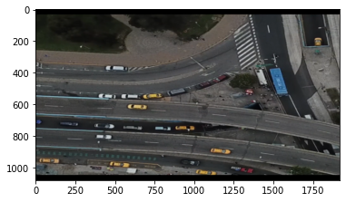
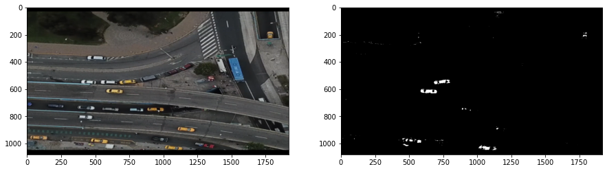

# Detectar color
Detectar el color de un vehículo puede ser de utilidad para detectar cierto tipo de transporte. Generalmente los taxis son amarillos, el angulos países el transporte público es verde, etc. En este caso, vamos a detectar el color amarillo.


```python
import matplotlib.pyplot as plt
import cv2
import numpy as np
```

Se importa una imagen con algunos taxis.


```python
img = cv2.imread('../imagenes/detectar-taxis.png')
img = cv2.cvtColor(img, cv2.COLOR_BGR2RGB)

plt.imshow(img)
```


    <matplotlib.image.AxesImage at 0x168f9c87820>


    

    


La detección de color necesita una imagen que utilice los canales HSV y no RGB.


```python
hsv = cv2.cvtColor(img, cv2.COLOR_RGB2HSV)
```

Se utiliza la función `inRange` de OpenCV para detectar los valores que se asemelan al color amarillo.

El límite inferior y superior de los colores se define mediante tres valores: H (Hue), S (Saturation) y V (Value). 

En la vida real no es tan fácil encontrar los valores exactos de los colores, por lo que se debe hacer prueba y error. 


```python
lower = np.array([20, 60, 60])  
upper = np.array([40, 255, 255])
center_color = cv2.inRange(hsv,lower,upper)
```

Podemos ver que no todos los vehículos amarillos son detectados, pero podemos esperar que en un video las cosas mejoren, gracias a que el mismo vehículo aparecerá en varios frames.


```python
#show roi and mask in same figure
fig, ax = plt.subplots(1,2,figsize=(15,15))
ax[0].imshow(img)
ax[1].imshow(center_color,'gray')

plt.show()
```


    

    

