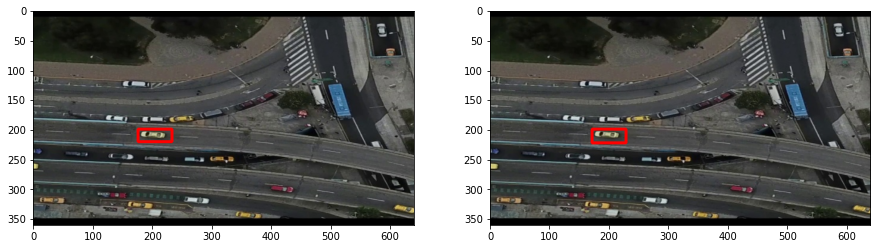

# Detectar el mismo objeto en frames consecutivos

Ahora que podemos detectar un objeto en un frame, debemos poder darle seguimiento a través del video. La forma de hacerlo será detectar el objeto en cada frame y comparar su posición con la del frame anterior. Si la posición es cercana, entonces el objeto es el mismo. 

## Repaso de clases anteriores


```python
# import libraries
import pandas as pd
import numpy as np
import matplotlib.pyplot as plt
import cv2
```

Voy a leer una secuencia de frames ya que el proceso de detección está hecho para videos. Serán 9 frames en total.


```python
# read images
images = []
for i in range(1,10):
    images.append(cv2.imread('../imagenes/conteo/frame'+str(i)+'.jpg'))   
```


```python
len(images)
```


    9


Cambio el color de la imagen para que pueda mostrarse correctamente com `plt.imshow()`.


```python
# correct color channels to RGB
for i in range(len(images)):
    images[i] = cv2.cvtColor(images[i], cv2.COLOR_BGR2RGB)
```

Mostraré sólo los últimos 4 frames.


```python
# show all images in same figure
# only 4 last images 
fig, axs = plt.subplots(2,2, figsize=(10,5))
axs[0,0].imshow(images[5])
axs[0,1].imshow(images[6])
axs[1,0].imshow(images[7])
axs[1,1].imshow(images[8])

plt.show()
```


    

    


### Aplicar el algoritmo sustractor de fondo


```python
backSub = cv2.createBackgroundSubtractorMOG2(history=50, detectShadows=False)
```

Hay que recordar que el sustractor necesita de un video. Por eso, los primeros frames son usados para entrenar el algoritmo. Esto significa que no habrá detección en esos frames.


```python
# apply background subtraction in all images
fg_masks = []
for i in range(len(images)):
    fg_mask = backSub.apply(images[i])
    fg_masks.append(fg_mask)
    
```

El resultado se puede apreciar en los últimos 4 frames.


```python
# only 4 last images
fig, axs = plt.subplots(2,2, figsize=(10,5))
axs[0,0].imshow(fg_masks[5], cmap='gray')
axs[0,1].imshow(fg_masks[6], cmap='gray')
axs[1,0].imshow(fg_masks[7], cmap='gray')
axs[1,1].imshow(fg_masks[8], cmap='gray')

plt.show()

```


    

    


### Aplicar filtros

Es hora de eliminar el ruido. Todo esto ya fue explicado en clases anteriores.


```python
#Kernel
kernel_close = cv2.getStructuringElement(cv2.MORPH_ELLIPSE, (9, 7))
kernel = cv2.getStructuringElement(cv2.MORPH_ELLIPSE, (5, 5))
```


```python
## apply opening, closing and dilation in all images
fg_masks_closed = []
for i in range(len(fg_masks)):
    fg_mask_closed = cv2.morphologyEx(fg_masks[i], cv2.MORPH_CLOSE, kernel_close)
    fg_mask_closed = cv2.morphologyEx(fg_mask_closed, cv2.MORPH_OPEN, kernel)
    fg_mask_closed = cv2.dilate(fg_mask_closed, kernel, iterations=1)
    fg_masks_closed.append(fg_mask_closed)

# show all images in same figure
# only 4 last images
fig, axs = plt.subplots(2,2, figsize=(10,5))
axs[0,0].imshow(fg_masks_closed[5], cmap='gray')
axs[0,1].imshow(fg_masks_closed[6], cmap='gray')
axs[1,0].imshow(fg_masks_closed[7], cmap='gray')
axs[1,1].imshow(fg_masks_closed[8], cmap='gray')

plt.show()

```


    

    


### Detectar los vehículos en el primer frame

Ya estamos cerca de terminar el repaso, vamos a detectar los vehículos en el primer frame. 


```python
img = fg_masks_closed[5]
```


```python
plt.imshow(img, cmap='gray')
```


    <matplotlib.image.AxesImage at 0x182325ebb50>


    

    


Se encuentran los contornos.


```python
contours, hierarchy = cv2.findContours(img, cv2.RETR_EXTERNAL, cv2.CHAIN_APPROX_TC89_L1)
```


```python
len(contours)
```


    59


Se generan rectángulos alrededor de los contornos.


```python
rectangulos = []
for cn in contours:
    #se obtienen rectágulos
    (x, y, w, h) = cv2.boundingRect(cn)
    rectangulos.append((x, y, w, h))
```

Ahora clasificamos los contornos en vehículos livianos y pesados de acuerdo a su tamaño.


```python
medidas_liviano = {
    'min_width': 30,
    'max_width': 70,
    'min_height': 15,
    'max_height': 70
}
medidas_pesado = {
    'min_width': 71,
    'max_width': 200,
    'min_height': 71,
    'max_height': 200
}
```

Utilizo un diccionario para que sea más explicativo. Simplemente defino la altura mínima y máxima de los vehículos livianos y pesados. Luego, recorro los contornos y los clasifico.


```python
pesados = []
livianos = []
for (x,y,w,h) in rectangulos:
    if(w >= medidas_pesado['min_width'] and w <= medidas_pesado['max_width'] and h >= medidas_pesado['min_height'] and h <= medidas_pesado['max_height']):
        pesados.append((x,y,w,h))
    elif(w >= medidas_liviano['min_width'] and w <= medidas_liviano['max_width'] and h >= medidas_liviano['min_height'] and h <= medidas_liviano['max_height']):
        livianos.append((x,y,w,h))

print('Pesados: ', len(pesados))
print('Livianos: ', len(livianos))
```

    Pesados:  1
    Livianos:  9
    

Se detectó una mancha como vehículo pesado. Esto se puede refinar corrigiendo el tamaño, pero lo dejé así para que se vea que el algoritmo funciona.


```python
# draw rectangles in original image copy
img_copy = images[5].copy()
for (x,y,w,h) in pesados:
    cv2.rectangle(img_copy, (x, y), (x + w, y + h),(0, 0, 255), 3)
for (x,y,w,h) in livianos:
    cv2.rectangle(img_copy, (x, y), (x + w, y + h),(255, 0, 0), 3)

# show image
plt.imshow(img_copy)
```


    <matplotlib.image.AxesImage at 0x18233afb310>


    

    


## Detectar el mismo vehículo en frames consecutivos

Ahora vamos a detectar el mismo vehículo en frames consecutivos.

Elegimos un solo auto liviano para que sea más fácil.


```python
liviano = livianos[7]
```


```python
# draw rectangle in original image copy
img_copy = images[5].copy()
cv2.rectangle(img_copy, (liviano[0], liviano[1]), (liviano[0] + liviano[2], liviano[1] + liviano[3]),(255, 0, 0), 3)

# show image
plt.imshow(img_copy)
```


    <matplotlib.image.AxesImage at 0x18232aa0f70>


    

    


Ahora vamos a detectar todos los vehículos en el frame siguiente.


```python
# next image
img2 = fg_masks_closed[6]
# find contours
contours2, hierarchy2 = cv2.findContours(img2, cv2.RETR_EXTERNAL, cv2.CHAIN_APPROX_TC89_L1)
# get rectangles
rectangulos2 = []
for cn in contours2:
    (x, y, w, h) = cv2.boundingRect(cn)
    rectangulos2.append((x, y, w, h))
# get livianos and pesados
pesados2 = []
livianos2 = []
for (x,y,w,h) in rectangulos2:
    if(w >= medidas_pesado['min_width'] and w <= medidas_pesado['max_width'] and h >= medidas_pesado['min_height'] and h <= medidas_pesado['max_height']):
        pesados2.append((x,y,w,h))
    elif(w >= medidas_liviano['min_width'] and w <= medidas_liviano['max_width'] and h >= medidas_liviano['min_height'] and h <= medidas_liviano['max_height']):
        livianos2.append((x,y,w,h))
# draw rectangles in original image copy
img_copy2 = images[6].copy()
for (x,y,w,h) in pesados2:
    cv2.rectangle(img_copy2, (x, y), (x + w, y + h),(0, 0, 255), 3)
for (x,y,w,h) in livianos2:
    cv2.rectangle(img_copy2, (x, y), (x + w, y + h),(255, 0, 0), 3)
# show image
plt.imshow(img_copy2)
```


    <matplotlib.image.AxesImage at 0x18233bd8970>


    

    


Nos quedamos sólo con los livianos.


```python
len(livianos2)
```


    5


De los vehículos livianos detectados en el frame actual, tenemos que elegir el que se encuentre más cerca del vehículo detectado en el frame anterior.

Sacamos el centro del rectángulo que contiene al vehículo.


```python
def get_centroid(rect):
    x,y,w,h = rect
    return (x + w/2, y + h/2)
```

Usaremos la distancia euclidiana para calcular la distancia entre los centros de los rectángulos que contienen a los vehículos.


```python
import math
```


```python
def get_distance(rect1, rect2):
    c1 = get_centroid(rect1)
    c2 = get_centroid(rect2)
    return math.sqrt((c1[0] - c2[0])**2 + (c1[1] - c2[1])**2)
```

Vamos a comparar la distancia entre todos los rectángulos del frame actual con el rectángulo del frame anterior. Necesitamos una distancia mínima de referencia.


```python
min_dist = math.inf
```


```python
same_car = None
for l2 in livianos2:
    dist = get_distance(liviano, l2)
    if dist < min_dist:
        min_dist = dist
        same_car = l2

```

Si encontró un vehículo que cumple con la distancia mínima, entonces lo vamos a almacenar en una variable. Abajo se puede ver el vehículo que se encontró.


```python
if same_car:
    print('Same car found!')
    print('Distance: ', min_dist)
    # draw rectangle in original image copy
    img_copy = images[6].copy()
    cv2.rectangle(img_copy, (same_car[0], same_car[1]), (same_car[0] + same_car[2], same_car[1] + same_car[3]),(255, 0, 0), 3)
    # show image
    plt.imshow(img_copy)
```

    Same car found!
    Distance:  5.0990195135927845
    


    

    


Logramos encontrar el mismo vehículo en dos frames consecutivos.


```python
# show both images in same figure
# draw liviano rectangle in original image copy
img_copy = images[5].copy()
cv2.rectangle(img_copy, (liviano[0], liviano[1]), (liviano[0] + liviano[2], liviano[1] + liviano[3]),(255, 0, 0), 3)
# draw same_car rectangle in original image copy
img_copy2 = images[6].copy()
cv2.rectangle(img_copy2, (same_car[0], same_car[1]), (same_car[0] + same_car[2], same_car[1] + same_car[3]),(255, 0, 0), 3)
# show image
fig, ax = plt.subplots(1, 2, figsize=(15, 15))
ax[0].imshow(img_copy)
ax[1].imshow(img_copy2)

plt.show()
```


    

    


Con estos resultados, debemos crear una lista que almacene las posiciones del vehículo que estamos siguiendo.


```python
current_vehicle_path = [liviano, same_car]
```


```python
current_vehicle_path
```


    [(176, 199, 57, 21), (171, 199, 57, 23)]


### Generalizar el algoritmo

El siguiente paso es encontrar el vehículo en todos los frames.

Vamos a colocar el proceso en funciones para que sea más fácil de entender e implementar.

Primero una función para detectar los objetos de una imagen filtrada y devuelva los rectángulos que los contienen.


```python
def get_rectangles(filtered_img):
    # find contours
    contours, hierarchy = cv2.findContours(filtered_img, cv2.RETR_EXTERNAL, cv2.CHAIN_APPROX_TC89_L1)
    # get rectangles
    rectangulos = []
    for cn in contours:
        (x, y, w, h) = cv2.boundingRect(cn)
        rectangulos.append((x, y, w, h))
    return rectangulos
```

Luego, una función para clasificar los objetos de acuerdo al tamaño.


```python
def classify_vehicles(rectangulos):
    # get livianos
    pesados = []
    livianos = []
    for (x,y,w,h) in rectangulos:
        if(w >= medidas_pesado['min_width'] and w <= medidas_pesado['max_width'] and h >= medidas_pesado['min_height'] and h <= medidas_pesado['max_height']):
            pesados.append((x,y,w,h))
        elif(w >= medidas_liviano['min_width'] and w <= medidas_liviano['max_width'] and h >= medidas_liviano['min_height'] and h <= medidas_liviano['max_height']):
            livianos.append((x,y,w,h))
    return pesados, livianos
```

En tercer lugar, una función para detectar el objeto más cercano al objeto detectado en el frame anterior.

Tenemos una lista: `current_vehicle_path` que almacena las posiciones de un vehículo en frames consecutivos. La otra lista: `current_frame_vehicles` almacena las posiciones de los vehículos detectados en el frame actual.

La función retorna un rectángulo que contiene al vehículo que se está siguiendo.


```python
def get_closest_vehicle(
        current_vehicle_path, 
        current_frame_vehicles):
    # find same car in current_frame_vehicles list
    min_dist = math.inf
    same_car = None
    for l in current_frame_vehicles:
        dist = get_distance(current_vehicle_path[-1], l)
        if dist < min_dist:
            min_dist = dist
            same_car = l
    return same_car
```

Ahora vamos a aplicar el proceso a todos los frames. Gracias a las funciones, el código es más fácil de entender.


```python
# get vehicles in first image
img = fg_masks_closed[3]
rectangulos = get_rectangles(img)
pesados, livianos = classify_vehicles(rectangulos)

print('Pesados: ', len(pesados))
print('Livianos: ', len(livianos))

# show rectangles in image
img_copy = images[3].copy()
for (x,y,w,h) in pesados:
    cv2.rectangle(img_copy, (x,y), (x+w, y+h), (0, 0, 255), 2)
for (x,y,w,h) in livianos:
    cv2.rectangle(img_copy, (x,y), (x+w, y+h), (0, 255, 0), 2)
plt.imshow(img_copy)
```

    Pesados:  0
    Livianos:  5
    


    <matplotlib.image.AxesImage at 0x18233b42ca0>


    

    


Elegimos un vehículo liviano del primer frame.


```python
liviano = livianos[4]
```


```python
# show rectangle in image
img_copy = images[3].copy()
cv2.rectangle(img_copy, (liviano[0],liviano[1]), (liviano[0]+liviano[2], liviano[1]+liviano[3]), (0, 255, 0), 2)
plt.imshow(img_copy)
```


    <matplotlib.image.AxesImage at 0x18233caae50>


    

    


Detectamos el vehículo en los frames siguientes.


```python
current_vehicle_path = [liviano]
```


```python
for i in range(4, 8):
    # get vehicles in current image
    img = fg_masks_closed[i]
    rectangulos = get_rectangles(img)
    pesados, livianos = classify_vehicles(rectangulos)
    # get closest vehicle
    closest_vehicle = get_closest_vehicle(current_vehicle_path, livianos)
    if(closest_vehicle):
        current_vehicle_path.append(closest_vehicle)
```

Finalmente, vamos a graficar el recorrido del vehículo. Mostraré el primer frame y el último frame. Las imágenes finales son un acercamiento para que se pueda apreciar mejor.


```python
# draw rectangles centroids in original image copy
# and in last image
img_copy = images[3].copy()
img_copy2 = images[-1].copy()

for (x,y,w,h) in current_vehicle_path:
    c = get_centroid((x,y,w,h))
    cv2.circle(img_copy, (int(c[0]), int(c[1])), 5, (0, 0, 255), -1)
    cv2.circle(img_copy2, (int(c[0]), int(c[1])), 5, (0, 0, 255), -1)

# first centroid
c = get_centroid(current_vehicle_path[0])

#convert c to int
c = (int(c[0]), int(c[1]))

# get a region of interest close to centroid
roi = img_copy[c[1]-100:c[1]+100, c[0]-100:c[0]+100]
roi2 = img_copy2[c[1]-100:c[1]+100, c[0]-100:c[0]+100]

# show copy images and roi images in same figure
# two rows, two columns
fig, ax = plt.subplots(2, 2, figsize=(15, 15))
# put subtitles of original images
ax[0,0].set_title('Original image 3')
ax[0, 0].imshow(img_copy)
ax[0,1].set_title('Original image 8')
ax[0, 1].imshow(img_copy2)
# put subtitles of roi images
ax[1,0].set_title('ROI image 3')
ax[1, 0].imshow(roi)
ax[1,1].set_title('ROI image 8')
ax[1, 1].imshow(roi2)
plt.show()
```


    

    


Se puede observar una sucesión de puntos que representan el movimiento del vehículo. 

El desafío actual es detectar todos los vehículos en el video.
