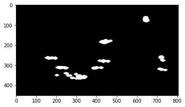
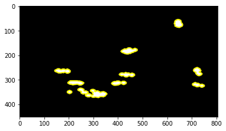
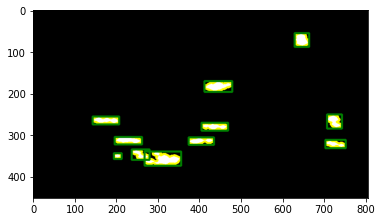
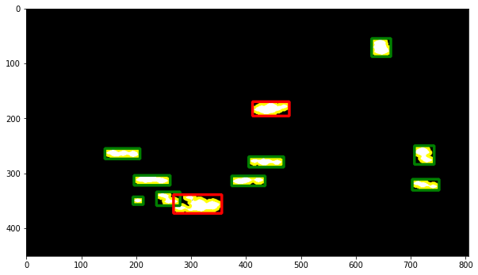

# Detección de bordes


```python
import matplotlib.pyplot as plt
import cv2
```

Importamos la imagen que obtuvimos en el paso anterior. La imagen debe ser en escala de grises para que la detección de bordes funcione correctamente.


```python
# Cargamos la imagen
img = cv2.imread('../imagenes/threshold.PNG',cv2.IMREAD_GRAYSCALE)
```


```python
# show image in grayscale
plt.imshow(img, cmap='gray')

```


    <matplotlib.image.AxesImage at 0x270f137af40>


    

    


Puede observarse que no tiene canales de color.


```python
img.shape
```


    (451, 806)


Se aplica la función `findContours` de openCV. Recibe la imagen, una constante `cv2.RETR_EXTERNAL` que indica que solo se buscan los contornos externos, y `cv2.CHAIN_APPROX_TC89_L1` que indica el algoritmo de aproximación de contornos.
Puedes encontrar más información en la [documentación](https://docs.opencv.org/2.4/modules/imgproc/doc/structural_analysis_and_shape_descriptors.html?#findcontours).


```python
contours, hierarchy = cv2.findContours(img, cv2.RETR_EXTERNAL, cv2.CHAIN_APPROX_TC89_L1)
```

El algoritmo encontró 11 contornos.


```python
len(contours)
```


    11


Voy a importar nuevamente la imagen para poder dibujar los contornos sobre ella. En este caso, importo la imagen sin escala de grises.


```python
img_color = cv2.imread('../imagenes/threshold.PNG')
```


```python
# show image 
plt.imshow(img_color)
```


    <matplotlib.image.AxesImage at 0x270f30bf250>


    

    


Puede verse que tiene los tres canales de color.


```python
img_color.shape
```


    (451, 806, 3)


Voy a dibujar los resultados del algoritmo de openCV.


```python
# draw contours
out_img = cv2.drawContours(img_color, contours, -1, (255,255,0), 3)
```


```python
# show image
plt.imshow(out_img)
```


    <matplotlib.image.AxesImage at 0x270f311b370>


    

    


Estos bordes, vistos en amarillo, no ofrecen buena información para el conteo de objetos. Por eso, voy a convertir estos bordes en rectángulos.

OpenCV tiene una función llamada `boundingRect` que recibe un contorno y devuelve un rectángulo que lo contiene. Luego guardo los datos del rectángulo en una lista.


```python
rectangulos = []
for cn in contours:
    #se obtienen rectágulos
    (x, y, w, h) = cv2.boundingRect(cn)
    #dibuja un rectángulo
    cv2.rectangle(img_color, (x,y), (x+w,y+h), (0, 128, 0), 3)
    rectangulos.append((x, y, w, h))
```

Puedes observar varios rectángulos que cubren los objetos (en verde). Estos rectángulos son los que voy a utilizar para clasificar vehículos.


```python
# show image color
plt.imshow(img_color)
```


    <matplotlib.image.AxesImage at 0x270f2834460>


    

    


## Detectar vehículos de acuerdo al tamaño
Ahora que tenemos varios rectángulos en la imagen, es fácil aplicar una clasificación basada en el tamaño. De esta forma, podemos diferenciar entre personas, autos, camiones, etc.

Hay que tomar en cuenta que cada rectángulo cuenta con la información de ancho y alto en la posición 2 y 3 de la tupla.


```python
rectangulos[0]
```


    (194, 343, 19, 14)


De acuerdo al alto y ancho del rectángulo, creo una lista de vehículos pesados.


```python
pesados = []
for rectangulo in rectangulos:
    if(rectangulo[2]>=50 and rectangulo[3]>=20):
        pesados.append(rectangulo)
```

Luego, puedo dibujar los rectángulos de los vehículos pesados con un color diferente.


```python
for pesado in pesados:
    #se obtienen rectágulos
    (x, y, w, h) = pesado
    #dibuja un rectángulo
    cv2.rectangle(img_color, (x,y), (x+w,y+h), (255, 0, 0), 3)
```

Cabe recalcar que los bordes fueron detectados en la imagen en escala de grises y los contornos son dibujados en la imagen que tiene los tres canales de color. Esto significa que se puede utilizar la información de los bordes para observar los resultados en la imagen original (antes de eliminar el fondo).


```python
plt.figure(figsize=(10,10))
plt.imshow(img_color)
```


    <matplotlib.image.AxesImage at 0x270f288d760>


    

    


La imagen final puede refinarse, pero ya podemos ver que el algoritmo funciona. La mejor manera de corregir la clasificación de acuerdo al tamaño es dibujar los rectángulos en la imagen original. Hay que recordar que este algoritmo está diseñado para videos, así que sólo puedo mostrate una captura del proyecto funcionando.


Si has seguido los pasos, seguramente podrás ver los resultados en tus propios videos.
