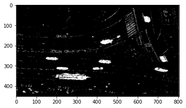
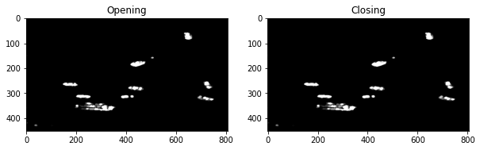
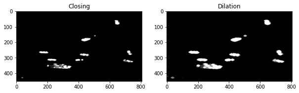
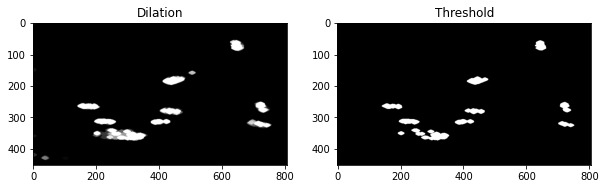
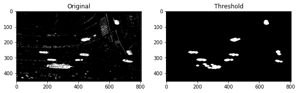

# Aplicación de filtros a imágenes

La detección de objetos se puede merorar con la utilización de filtros que eliminen el ruido de la imagen. En este caso, se utilizarán filtros de suavizado para que sólo permanezcan las formas más importantes.

A la hora de contar vehículos, queremos eliminar los bordes de las calles y que las formas de los vehículos no tengan espacios vacíos.


```python
import cv2
import matplotlib.pyplot as plt
```


```python
img_no_bg = cv2.imread('../imagenes/sin_fondo.PNG',cv2.IMREAD_GRAYSCALE)
```


```python
# show image
plt.imshow(img_no_bg, cmap='gray')
plt.show()

```


    

    


Puedes encontrar la documentación de los filtros en la [documentación de OpenCV](https://docs.opencv.org/4.x/d9/d61/tutorial_py_morphological_ops.html).

Los filtros necesitan un kernel que es una matriz de 1s y 0s. El tamaño del kernel determina el tamaño del filtro. Mientras más grande sea el filtro los efectos serán más notorios.


```python
#Kernel
kernel_close = cv2.getStructuringElement(cv2.MORPH_ELLIPSE, (9, 7))
kernel = cv2.getStructuringElement(cv2.MORPH_ELLIPSE, (5, 3))
```

## Opening 
Ayuda a remover el ruido. 


```python
opening = cv2.morphologyEx(img_no_bg, cv2.MORPH_OPEN, kernel_close)
```


```python
# show the output images in same figure
fig, ax = plt.subplots(1, 2, figsize=(10, 5))
ax[0].imshow(img_no_bg, cmap='gray')
ax[0].set_title('Original')
ax[1].imshow(opening, cmap='gray')
ax[1].set_title('Opening')
plt.show()
```


    

    


## Closing
Ayuda a cerrar los huecos en las formas.


```python
closing = cv2.morphologyEx(opening, cv2.MORPH_CLOSE, kernel)
```


```python
# show the output images in same figure
fig, ax = plt.subplots(1, 2, figsize=(10, 5))
ax[0].imshow(opening, cmap='gray')
ax[0].set_title('Opening')
ax[1].imshow(closing, cmap='gray')
ax[1].set_title('Closing')
plt.show()
```


    

    


El resultado sería más evidente en figuras más grandes.

## Dilation
Ayuda a que las formas se expandan. Esto puede servir si un objeto es partido en pedazos por la eliminación del fondo.


```python
dilation = cv2.dilate(closing, kernel, iterations=3)
```


```python
# show the output images in same figure
fig, ax = plt.subplots(1, 2, figsize=(10, 5))
ax[0].imshow(closing, cmap='gray')
ax[0].set_title('Closing')
ax[1].imshow(dilation, cmap='gray')
ax[1].set_title('Dilation')
plt.show()
```


    

    


El resultado es claro en el vehículo de la parte inferior izquierda.

## Threshold
Finalmente, se aplica un threshold para eliminar el ruido restante.


```python
# threshold
threshold = dilation.copy()
threshold[threshold < 250] = 0 
```


```python
# show the output images in same figure
fig, ax = plt.subplots(1, 2, figsize=(10, 5))
ax[0].imshow(dilation, cmap='gray')
ax[0].set_title('Dilation')
ax[1].imshow(threshold, cmap='gray')
ax[1].set_title('Threshold')
plt.show()

```


    

    


Puede observarse que desaparecen ciertos puntos grises.

Hemos convertido una imagen compleja en una simple sobre la cual es fácil aplicar un algoritmo para encontrar objetos.


```python
# show firts image and last image
fig, ax = plt.subplots(1, 2, figsize=(10, 5))
ax[0].imshow(img_no_bg, cmap='gray')
ax[0].set_title('Original')
ax[1].imshow(threshold, cmap='gray')
ax[1].set_title('Threshold')
plt.show()
```


    

    


El vehículo pesado sufre un poco de daño, pero el resto se convierten en figuras claras y fáciles de contar.


```python
# save threshold image
cv2.imwrite('../imagenes/threshold.PNG', threshold)
```


    True


