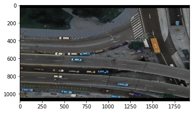
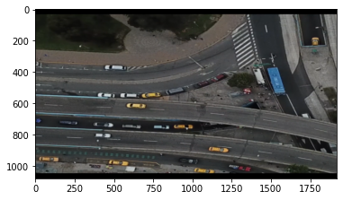
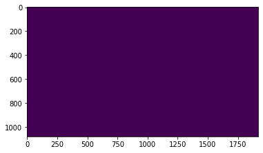
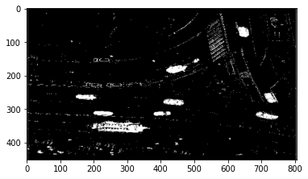

# Uso del sustractor de fondo

Sustraer el fondo de una imagen es bastante útil para el conteo de objetos, pues permite enfocarse en los bordes. En este notebook se muestra un ejemplo de sustracción de fondo usando el algoritmo de OpenCV.

## OpenCV

Open CV es la biblioteca principal para trabajar con imágenes. Se importa mediante el nombre cv2.


```python
#open CV
import cv2
import matplotlib.pyplot as plt
```

OpenCV permite eliminar el fondo de una imagen o video mediante la función:


```python
backSub = cv2.createBackgroundSubtractorMOG2(history=50, detectShadows=False)
```

Este objeto será usado para eliminar el fondo.
* `history` toma en cuenta cuántos frames anteiores se usan para considerar lo que es el fondo. Si un objeto aparece en la misma posición durante los mismos frames que el history, el objeto es tomado como fondo (aplicable en videos).
* `detectShadow` incluye las sombras como parte del objeto, en este caso es falso, las sombras serán eliminadas como parte del fondo.

## Ejemplo

Se utiliza una imagen de ejemplo de un vehículo visto de frente.


```python
img = cv2.imread('../imagenes/vehiculos.png')
plt.imshow(img)
```


    <matplotlib.image.AxesImage at 0x214b8058a90>


    

    


La imagen no tiene los colores correctos pues OpenCV importa la imagen en orden BGR y pyplot utiliza RGB.


```python
img = cv2.cvtColor(img,cv2.cv2.COLOR_BGR2RGB)
plt.imshow(img)
```


    <matplotlib.image.AxesImage at 0x214b80cb0d0>


    

    


Para elminiar el fondo se utilizar la función apply del objeto backsub.


```python
new_img = backSub.apply(img,None,0.03)
plt.imshow(new_img)
```


    <matplotlib.image.AxesImage at 0x214b8bf2430>


    

    


En este caso no fue capaz de detectar al objeto pues no tiene frames anteriores de referencia. 

La imagen de abajo es el resultado de aplicar el script que se encuentra al final del notebook sobre un video.


```python
img = cv2.imread('../imagenes/sin_fondo.PNG',cv2.IMREAD_GRAYSCALE)
plt.imshow(img,'gray')
```


    <matplotlib.image.AxesImage at 0x214b9c76580>


    

    


El fondo se ha eliminado y sólo se encuentra la silueta de los vehículos.

## Ejemplo real

Puedes hacer una prueba simple con el siguiente script.


```python
import cv2

# Abrir el archivo del video
path = 'sur_oriente.mp4'
capture = cv2.VideoCapture(path)

# Comprobar que el archivo exista
if not capture.isOpened:
    print('Unable to open: ' + path)
    exit(0)

################################
# MODULO DE ELIMINAR FONDO
################################
backSub = cv2.createBackgroundSubtractorMOG2(history=300, detectShadows=False)
################################
################################

while True:
    ret, frame = capture.read()
    if frame is None:
        break  

    ##################################
    # CAMBIAR ALTURA Y ANCHO
    ###################################
    # 1
    height , width , layers =  frame.shape
    resized_frame = cv2.resize(frame, (width//3, height//3)) 
    ###################################

    #-------------------------------------------------
    ##################################
    # ELIMINAR FONDO
    # Ex: backSub.apply(input,output,learning_rate)
    ##################################
    # 2
    back_mask = backSub.apply(resized_frame,None, 0.003)
    ##################################

    #-----------------------------------------------------
    ##################################
    # MOSTRAR LA IMAGEN
    ##################################
    cv2.imshow('Frame_original', frame)
    # 1
    cv2.imshow('Frame_menor', resized_frame)
    # 2
    cv2.imshow('Frame_mascara', back_mask)

    #--------------------------------------------------
    #cerrar el programa al presionar Esc
    keyboard = cv2.waitKey(30)
    ##################################
    ##################################

    if keyboard == 'q' or keyboard == 27:
        break      
```

Guarda el archivo como `test.py` y ejecútalo en tu terminal.

```bash
python test.py
```


## Otro ejemplo

Puedes ver todo el proceso en mi taller de visión artificial en el que se utiliza este método. No utilizo videos en este notebook, porque jupyter no trabaja muy bien con ellos. Pero tengo suficiente material de referencia para que puedas hacerlo tú mismo.
* [Taller de visión artificial, video](https://www.youtube.com/watch?v=40GzJA3xB_k)
* [Taller de visión artificial, código](https://github.com/danielTeniente/tallerIA_detection)
